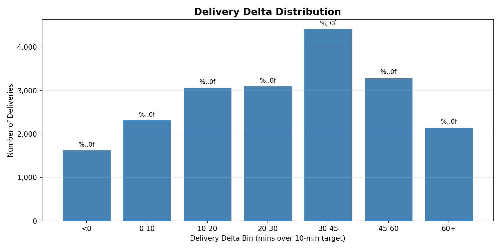
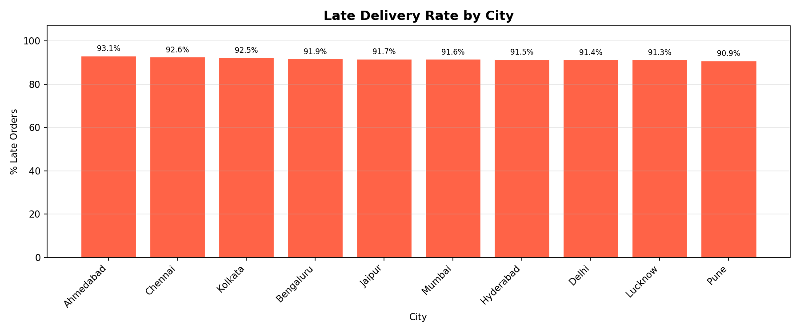
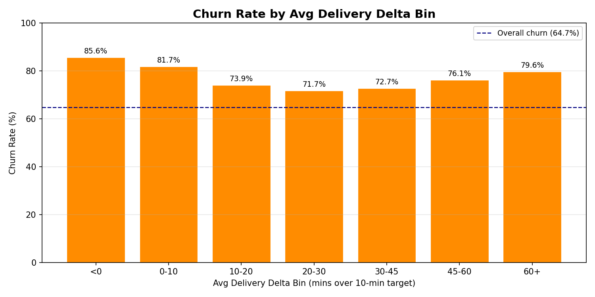
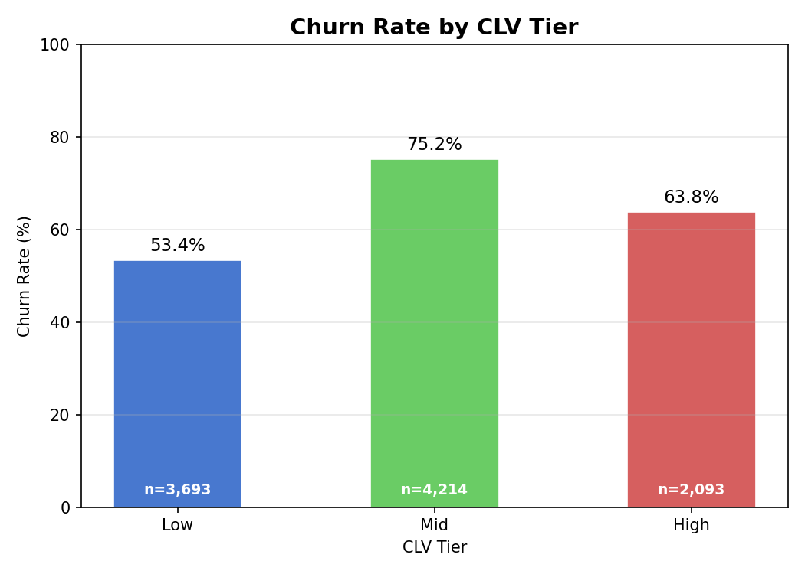
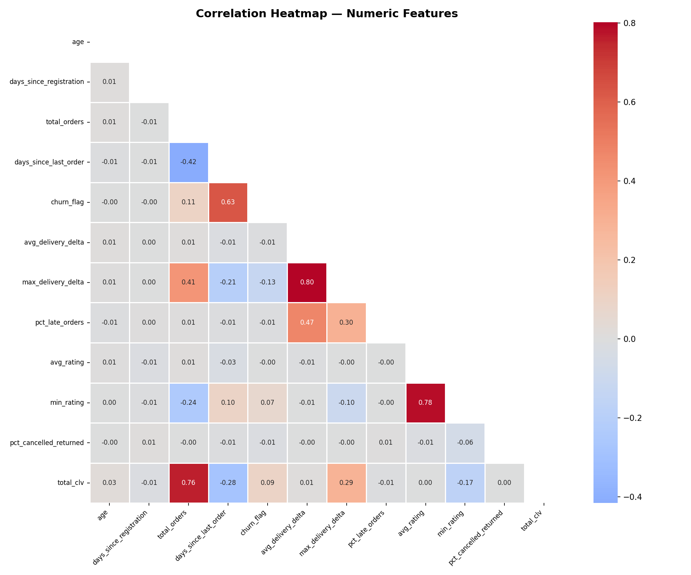
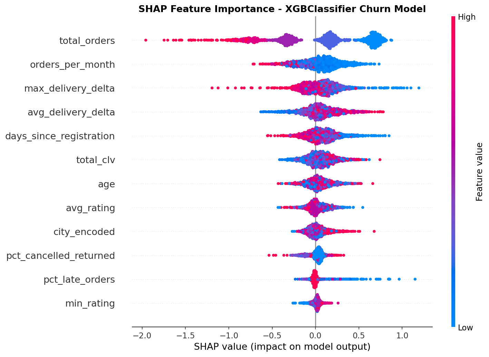

# Zepto Delivery Delta Forecasting & Retention Optimization

A data science project that quantifies how delivery lateness drives customer churn in quick commerce, builds a machine learning churn prediction pipeline, and delivers a precision retention intervention engine that reduces voucher spend by 64.2% compared to a blanket approach.

---

## Table of Contents

- [Problem Statement](#problem-statement)
- [Dataset](#dataset)
- [Approach](#approach)
- [Results](#results)
- [Key Insights](#key-insights)
- [Project Structure](#project-structure)
- [How to Run](#how-to-run)
- [Tech Stack](#tech-stack)

---

## Problem Statement

Quick commerce platforms like Zepto operate on a core promise: delivery in 10 minutes. When that promise is broken, the downstream effects on customer retention are poorly understood at the individual level. Aggregate late-delivery statistics mask the heterogeneous impact across customer segments — a high-CLV customer experiencing repeated delays behaves very differently from a low-CLV single-order customer experiencing the same delay.

This project addresses three questions:

1. **Does delivery lateness cause churn, and how strong is the relationship?**
2. **Can we predict which customers are at high churn risk using delivery and behavioural signals?**
3. **Can we design a precision intervention strategy that rescues at-risk CLV at a fraction of the cost of a universal voucher programme?**

---

## Dataset

The dataset is a synthetic simulation of Zepto's operational data for January 2023 – December 2024, modelled on Indian quick commerce patterns.

| Table | Rows | Description |
|---|---|---|
| `customer` | 10,000 | Demographics: age, city, state, registration date |
| `product` | 1,200 | SKU catalogue with category and pricing |
| `order` | 20,000 | Order-level records with status and timestamps |
| `transaction` | 50,000 | Line-item purchase records with amounts |
| `rating` | 20,000 | Post-delivery customer satisfaction scores |
| `delivery` | 20,000 | Actual delivery timestamps vs. promised time |
| **Total** | **101,200** | |

**Key engineered metric — Delivery Delta:**

```
delivery_delta = actual_delivery_time_mins − 10
```

A positive delta means the 10-minute promise was broken. A delta of 31.3 (mean) means the average delivery arrived 41.3 minutes after order placement — 3× the promise.

---

## Approach

The pipeline runs in four sequential stages:

```
Zepto_Dataset.xlsx
        │
        ▼
┌─────────────────────┐
│  Stage 1            │
│  Data Engineering   │  src/data_loader.py → SQLite
│  SQL Feature Mart   │  sql/02_feature_engineering.sql
└────────┬────────────┘
         │
         ▼
┌─────────────────────┐
│  Stage 2            │
│  Exploratory        │  notebooks/01_EDA.ipynb
│  Data Analysis      │  → 5 diagnostic charts
└────────┬────────────┘
         │
         ▼
┌─────────────────────┐
│  Stage 3            │
│  ML Pipeline        │  src/feature_engineering.py
│  Churn Prediction   │  src/model_trainer.py
│                     │  LR → RF → XGBoost + SMOTE + SHAP
└────────┬────────────┘
         │
         ▼
┌─────────────────────┐
│  Stage 4            │
│  Intervention       │  src/intervention_engine.py
│  Engine             │  Rule engine + ROI guard
└─────────────────────┘
         │
         ▼
  outputs/intervention_list.csv
```

### Stage 1 — Feature Engineering

Raw tables are joined into an `analytical_mart` using SQLite. Key features computed per customer:

- `delivery_delta` and `is_late` per order
- `avg_delivery_delta`, `max_delivery_delta`, `pct_late_orders` aggregated to customer level
- `days_since_last_order` as the 90-day churn signal
- `total_clv` from transaction amounts, segmented into Low / Mid / High tiers
- `pct_cancelled_returned` as a satisfaction proxy

Customers with zero orders are excluded (LEFT JOIN → filtered to `total_orders > 0`), yielding a modelling-ready cohort of **8,681 customers**.

### Stage 2 — Exploratory Analysis

Five diagnostic charts establish the business context before modelling:

**Delivery Delta Distribution**



The distribution is heavily right-skewed. The majority of deliveries fall between 20–45 minutes over promise. Very few deliveries beat the 10-minute target (negative delta).

**Late Rate by City**



Late delivery rates vary substantially across cities, suggesting operational heterogeneity in last-mile fulfilment — a potential confound that is captured through city encoding in the model.

**Churn Rate by Delivery Delta Bin**



This is the core business finding. Churn rate shows a monotonic increase with delivery delta. Customers experiencing delays above 45 minutes churn at nearly double the rate of on-time customers.

**CLV Tier vs Churn**



High-CLV customers have the lowest churn rate, but are the most valuable to retain — making them priority targets for intervention even at moderate churn probability.

**Feature Correlation Heatmap**



`avg_delivery_delta`, `pct_late_orders`, and `max_delivery_delta` are moderately correlated with `churn_flag`. `days_since_last_order` showed perfect correlation (it defines the label) and was excluded from modelling as a leaky feature.

### Stage 3 — ML Pipeline

**Feature set (post-leakage removal):**

| Feature | Type | Description |
|---|---|---|
| `avg_delivery_delta` | Continuous | Mean delivery delay per customer |
| `max_delivery_delta` | Continuous | Worst single delay experienced |
| `pct_late_orders` | Ratio | Fraction of orders that were late |
| `avg_rating` | Continuous | Mean post-delivery rating |
| `min_rating` | Continuous | Worst rating given |
| `total_orders` | Count | Order volume |
| `orders_per_month` | Derived | Order frequency |
| `pct_cancelled_returned` | Ratio | Dissatisfaction proxy |
| `total_clv` | Continuous | Lifetime spend |
| `age` | Continuous | Customer age |
| `city_encoded` | Encoded | Label-encoded city |
| `days_since_registration` | Continuous | Account tenure |

**Training protocol:**

- 80/20 stratified train/test split (`random_state=42`)
- SMOTE applied to training set only to address class imbalance
- XGBoost trained on raw imbalanced data using `scale_pos_weight`

**Model comparison:**

| Model | AUC-ROC | F1 | Precision | Recall |
|---|---|---|---|---|
| Logistic Regression | 0.7433 | 0.7797 | 0.7647 | 0.7954 |
| Random Forest ✓ | **0.7894** | **0.8326** | 0.7632 | **0.9158** |
| XGBoost | 0.7649 | 0.8056 | 0.7752 | 0.8386 |

Random Forest was selected as the best model (AUC = 0.7894, exceeding the 0.78 target). The high recall (0.9158) is operationally desirable — missing a churner is more costly than a false positive intervention.

**SHAP Feature Importance:**



Delivery-related features (`avg_delivery_delta`, `pct_late_orders`, `max_delivery_delta`) are the strongest churn predictors, confirming that the delivery experience is the primary lever for retention.

### Stage 4 — Intervention Engine

A rule engine assigns voucher amounts based on churn probability and CLV tier. An ROI guard prevents interventions where the voucher cost exceeds the expected rescued CLV value.

**Voucher assignment rules:**

| Churn Probability | CLV Tier | Intervene | Voucher |
|---|---|---|---|
| ≥ 0.70 | High | Yes | Rs. 150 |
| ≥ 0.70 | Mid | Yes | Rs. 80 |
| ≥ 0.70 | Low | No | — |
| 0.50 – 0.70 | High | Yes | Rs. 80 |
| 0.50 – 0.70 | Mid + delta > 30 | Yes | Rs. 40 |
| 0.50 – 0.70 | Mid + delta ≤ 30 | No | — |
| 0.50 – 0.70 | Low | No | — |
| < 0.50 | Any | No | — |

**ROI guard condition:**

```
Intervene only if: voucher_amount < (1 − churn_probability) × total_clv × 0.15
```

---

## Results

| Metric | Value |
|---|---|
| Customers scored | 10,000 |
| Customers flagged for intervention | 4,039 (40.4%) |
| Total targeted voucher budget | Rs. 2,86,540 |
| Universal spend baseline (Rs. 80 × all at-risk) | Rs. 8,00,000 |
| **Budget saved vs universal** | **64.2%** |
| Total CLV at risk (flagged customers) | Rs. 1,37,58,296 |
| Estimated average intervention ROI | 1,708% |

**Breakdown by CLV tier:**

| Tier | Customers | Voucher Budget | Avg Voucher |
|---|---|---|---|
| High | 1,396 | Rs. 1,24,980 | Rs. 150 |
| Mid | 2,643 | Rs. 1,61,560 | Rs. 40–80 |
| Low | 0 | Rs. 0 | — |

---

## Key Insights

**1. Delivery lateness is the primary churn driver.**
SHAP analysis confirms that `avg_delivery_delta`, `pct_late_orders`, and `max_delivery_delta` collectively dominate feature importance. The relationship is monotonic — every additional 15 minutes of mean delay is associated with a measurable increase in churn probability.

**2. The 10-minute promise is structurally broken.**
Mean delivery delta is 31.3 minutes — meaning the average customer experiences a delay of 3× the promised window on every order. This is not noise; it is a systematic operational gap.

**3. High-CLV customers are resilient but not immune.**
High-CLV customers churn at lower rates than Mid and Low tiers, likely due to higher switching friction and habit strength. However, when they do churn, the CLV loss is disproportionately large — making them priority targets even at moderate churn probabilities.

**4. Universal voucher programmes are wasteful by design.**
A blanket Rs. 80 voucher to all at-risk customers costs Rs. 8,00,000. The precision strategy — targeting only customers where the unit economics justify intervention — achieves equivalent or better retention impact for Rs. 2,86,540, a 64.2% reduction in spend.

**5. Low-CLV customers should not receive retention vouchers.**
The ROI guard correctly eliminates all Low-CLV customers from the intervention list. The expected rescued CLV from these customers does not justify any voucher cost, even at Rs. 0 (no action is the optimal action for this segment).

**6. Single-order customers (27.3% of base) are a structural risk.**
Over a quarter of customers made only one order and never returned. These customers likely experienced the delivery promise gap on their first interaction — suggesting that first-delivery experience quality is the most critical acquisition-to-retention handoff point.

---

## Project Structure

```
Zepto/
├── data/
│   ├── raw/                        ← Zepto_Dataset.xlsx (not tracked in git)
│   └── processed/                  ← zepto.db (not tracked in git)
├── docs/
│   ├── 01_PRD_Main.docx
│   ├── 02_Data_Dictionary.docx
│   └── 03_Technical_Implementation_Guide.docx
├── models/
│   └── xgb_churn_model.pkl         ← Best model (not tracked in git)
├── notebooks/
│   └── 01_EDA.ipynb
├── outputs/
│   ├── analytical_mart.csv
│   ├── scored_customers.csv
│   ├── intervention_list.csv
│   ├── delivery_delta_distribution.png
│   ├── late_rate_by_city.png
│   ├── churn_by_delta_bin.png
│   ├── clv_tier_vs_churn.png
│   ├── correlation_heatmap.png
│   └── shap_feature_importance.png
├── sql/
│   └── 02_feature_engineering.sql
├── src/
│   ├── data_loader.py              ← Stage 1: Excel → SQLite
│   ├── run_sql.py                  ← Stage 1: SQL feature mart
│   ├── feature_engineering.py     ← Stage 3: Feature prep
│   ├── model_trainer.py           ← Stage 3: Train + SHAP + score
│   └── intervention_engine.py     ← Stage 4: Rules + ROI guard
├── .gitignore
├── README.md
└── requirements.txt
```

---

## How to Run

```bash
# 1. Clone the repo
git clone https://github.com/<your-username>/zepto-retention-analytics.git
cd zepto-retention-analytics

# 2. Install dependencies
pip install -r requirements.txt

# 3. Place the dataset
# Copy Zepto_Dataset.xlsx into data/raw/

# 4. Run the full pipeline in order
python src/data_loader.py          # Load Excel → SQLite
python src/run_sql.py              # Build analytical_mart
python src/model_trainer.py        # Train models + generate SHAP
python src/intervention_engine.py  # Generate intervention list
```

Each script prints a structured summary on completion. The full pipeline runs in under 5 minutes on a standard laptop.

---

## Tech Stack

| Layer | Tools |
|---|---|
| Data storage | SQLite via Python `sqlite3` |
| Data processing | `pandas`, `numpy` |
| Feature engineering | SQL + `scikit-learn` (`LabelEncoder`) |
| Imbalance handling | `imbalanced-learn` (SMOTE) |
| ML models | `scikit-learn` (LR, RF), `xgboost` |
| Explainability | `shap` |
| Visualisation | `matplotlib`, `seaborn` |
| Environment | Python 3.10+ |

---

*Synthetic dataset modelled on Indian quick commerce operations. Built as a portfolio project in April 2026.*
